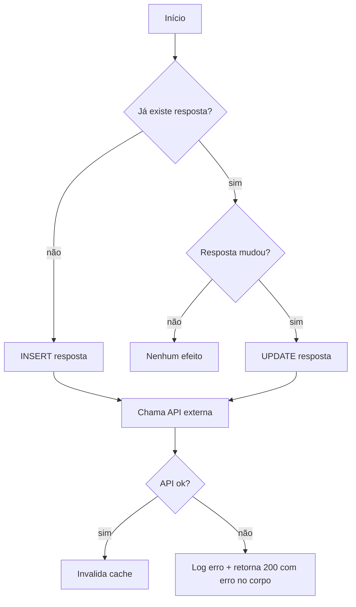

# 06 — Efeitos condicionais

> Muitos efeitos só disparam sob um branch específico. Documentar a **condição de disparo** com a mesma precisão do efeito é o que evita reproduzir um write que deveria ser condicional (ou esquecer um que só roda num caminho raro).

## Sumário

- [Por que a condição é tão importante quanto o efeito](#por-que-a-condição-é-tão-importante-quanto-o-efeito)
- [Como capturar a condição](#como-capturar-a-condição)
- [Caminhos fáceis de esquecer](#caminhos-fáceis-de-esquecer)
- [Representar com diagrama de sequência condicional](#representar-com-diagrama-de-sequência-condicional)
- [Saída esperada](#saída-esperada)

---

## Por que a condição é tão importante quanto o efeito

Numa rota de onboarding, é comum: "se é a primeira resposta, INSERT; senão UPDATE", ou "só chama a API externa se o campo X mudou". Reproduzir o efeito mas errar a condição gera dados a mais/a menos. A condição **faz parte** do efeito no AS-IS.

## Como capturar a condição

Para cada efeito mapeado (references 01–04), suba pelo call graph e registre **todas** as condições que precisam ser verdadeiras para ele disparar:

- `if`/`else`/`switch` que o envolvem.
- Early returns que o pulam.
- Guard clauses no topo do método.
- Estado que vem de leitura anterior (ex.: "existe registro?" decide insert vs update).
- Flags de feature, config, ou papel do usuário.

Expresse a condição em termos dos **dados reais** ("quando `resposta` muda em relação à salva"), não só a expressão literal do código.

## Caminhos fáceis de esquecer

- Branch de erro que ainda grava algo (log de auditoria, marca de tentativa).
- Caminho de "primeira vez" vs "reenvio".
- Efeito que só ocorre quando a API externa retorna determinado status.
- Cleanup em `finally`/shutdown que roda independentemente do sucesso.

## Representar com diagrama de sequência condicional

Para rotas com muitos branches, um diagrama deixa as condições explícitas. Use mermaid (texto):



O diagrama complementa, não substitui, a lista textual de efeitos com condições.

## Saída esperada

```markdown
## Efeitos condicionais — <METHOD> <path>

| Efeito | Condição de disparo (em dados reais) | Branch/local |
|--------|--------------------------------------|--------------|
| INSERT resposta | não existe resposta para (user, pergunta) | Service::save, if !found |
| UPDATE resposta | existe e o valor mudou | Service::save, else |
| Chamada API | sempre que houve insert ou update | após save |
| Invalida cache | só se API retornou 2xx | após resposta da API |
| Log auditoria | em qualquer caminho, inclusive erro | finally |

(opcional) Diagrama de sequência condicional: <mermaid acima>
```
